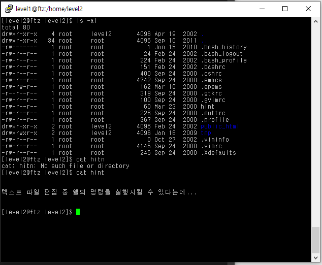
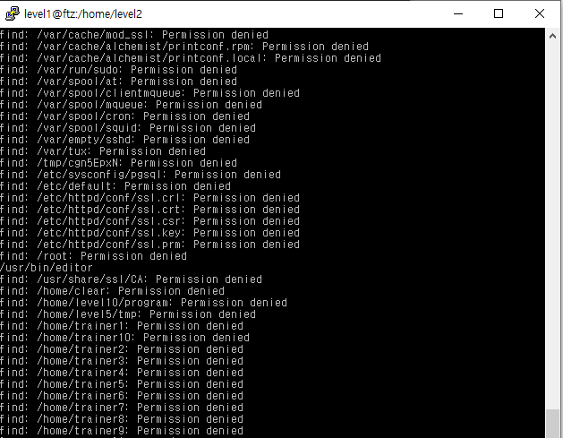
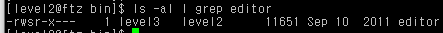
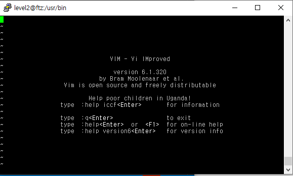
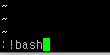

# level 2

* id : `level2`
* pw : `hacker or cracker`



마찬가지로 이번에도 소유주가 level3 인 프로그램을 찾아보자.
```
find / -user level3
```



`/usr/bin/editor` 가 있다.



권한이 `-rwsr-x---` 라서 setuid가 있고, level2그룹은 rx만 가능하고 level3 이 실사용자인것을 알수있다.

현재 계정인 level2는 rx가 가능하므로 실행이 가능하다.



`vim` 에디터이다.



`vim` 내에선 `!` 명령으로 리눅스 명령어를 실행할수 있으므로 이를통해 bash 쉘을 딴다.