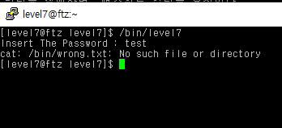
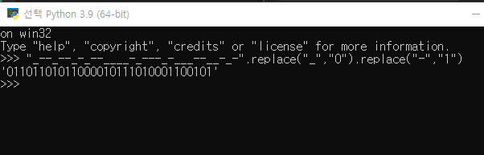
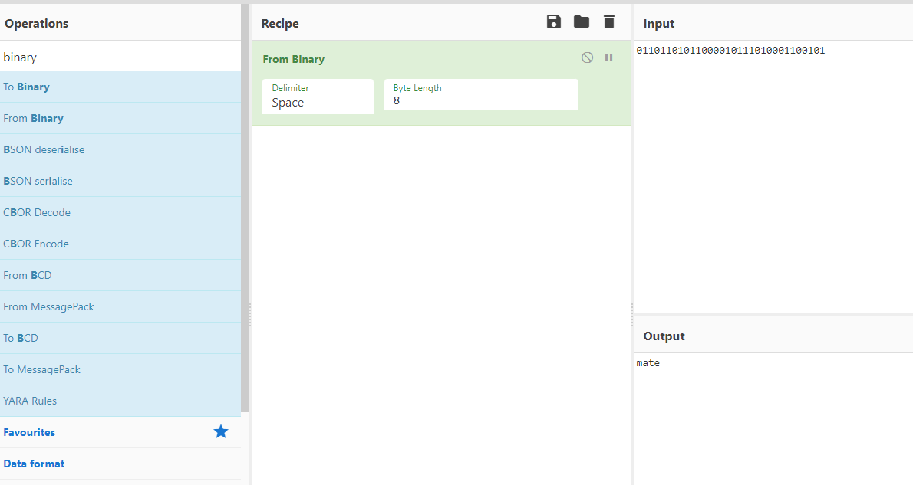
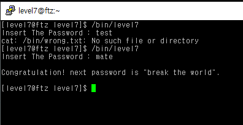

# level 7

* id : `level7`
* pw : `come together`




음.. 원래는 여기에 wrong.txt파일이 있어야 된다고 한다

구글링 해보니 이 vm이미지 자체의 문제라서 해결할순 없고..

gdb도 퍼미션 문제로 막혀있어서, 결국엔 다른 글을 보고 풀어야 한다.

```
원래 나오는 문장
_--_--_-_--____-_---_-___--__-_-
```

이를 0과 1로 변환해보자.





요즘 잘쓰는 파이썬 + [드림핵 사이버셰프](https://tools.dreamhack.games/cyberchef) 기능을 이용해 쉽게 복호화했고, 답은 `mate`다.



GG


## PS

사실 답이 하드코딩 되어있으므로, GDB가 있었다면 바로 답을 볼수 있었을 것이다.