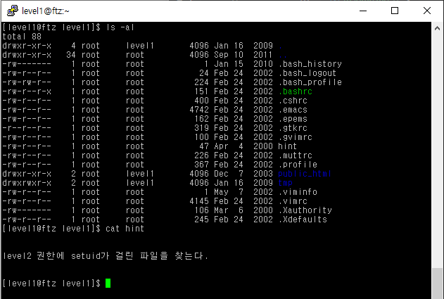
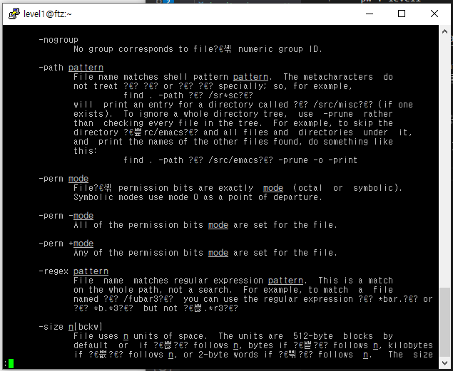
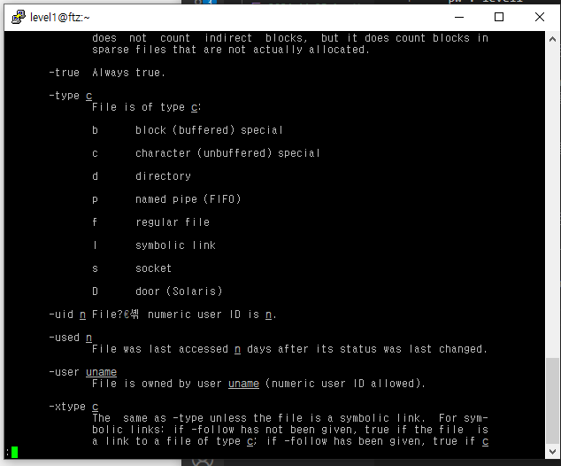
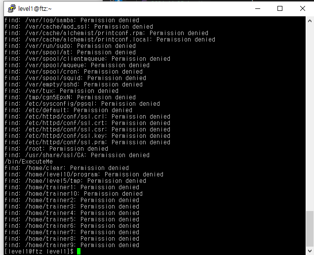
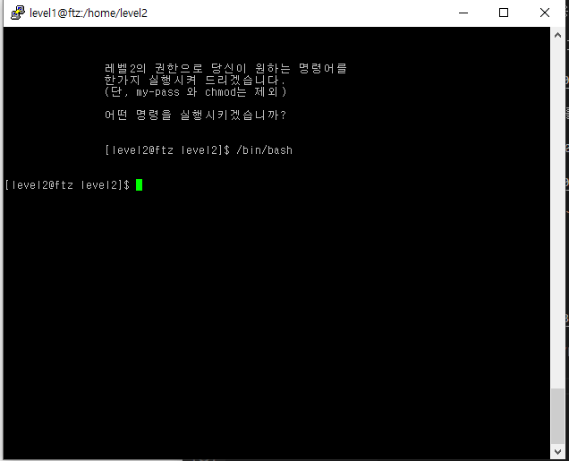

# Level 1

* id : `level1`
* pw : `level1`




열고 파일을 보면 hint 가 있다.
>SetUID가 걸린 파일을 실행하면, 그 UID를 가진 유저처럼 행동할 수 있다.


`find` 명령어를 이용해 파일을 찾을 수 있는데,

이때 파일의 권한, 크기, 소유주 등도 옵션으로 찾을 수 있다.



`find`의 man 페이지를 보면 `-perm` 옵션으로 특정 권한의 파일만 필터링이 가능하다.

`SetUID`가 걸리면 4000번대로 걸리기 때문에 이 옵션을 이용할 수 있다.



마찬가지로 소유주가 `level2` 여야 하므로 `-user` 옵션을 사용한다

```
find / -perm -4000 -user level2
```



딱보면 하나 있다. `/bin/ExecuteMe`.



level2 권한을 얻었다.