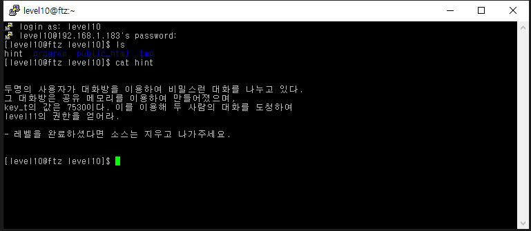
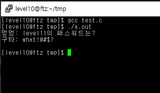

# level 10

* id : `level10`
* pw : `interesting to hack!`

공유 메모리는 `key_t`값만 있다면 타 프로세스에서도 같이 붙어서 볼수 있는 특징이 있다.

별다를 것 없이, 적당히 공유 메모리 이용해서 안의 값 출력하는 소스코드 붙여넣어서 하면 된다.

[참고](https://m.blog.naver.com/PostView.naver?isHttpsRedirect=true&blogId=bitnang&logNo=70172711414)

[내 소스코드](level10.c)

GG!

