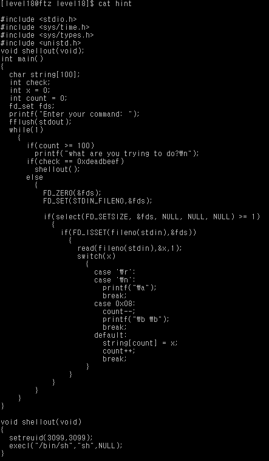

# level 18

* id : `level18`
* pw : `why did you do it`



좀 소스코드가 길다.

소스코드를 쓱 훑어보니 글자 개수가 100개가 넘으면 꺼지? 진 않고.. 어쨋든 계속되는 프로그램 같다.

평소처럼 저 check 에 deadbeef를 담으면 되는 듯 하다.


```python
0x08048550 <main+0>:    push   ebp
0x08048551 <main+1>:    mov    ebp,esp
0x08048553 <main+3>:    sub    esp,0x100                # 할당받은 버퍼 크기 (0x100 == 256)
0x08048559 <main+9>:    push   edi
0x0804855a <main+10>:   push   esi
0x0804855b <main+11>:   push   ebx
0x0804855c <main+12>:   mov    DWORD PTR [ebp-108],0x0
0x08048563 <main+19>:   mov    DWORD PTR [ebp-112],0x0
0x0804856a <main+26>:   push   0x8048800
0x0804856f <main+31>:   call   0x8048470 <printf>
0x08048574 <main+36>:   add    esp,0x4
0x08048577 <main+39>:   mov    eax,ds:0x804993c
0x0804857c <main+44>:   mov    DWORD PTR [ebp-252],eax
0x08048582 <main+50>:   mov    ecx,DWORD PTR [ebp-252]
0x08048588 <main+56>:   push   ecx
0x08048589 <main+57>:   call   0x8048430 <fflush>
0x0804858e <main+62>:   add    esp,0x4
0x08048591 <main+65>:   jmp    0x8048598 <main+72>              # while True 기 때문에 jmp문임
0x08048593 <main+67>:   jmp    0x8048775 <main+549>
0x08048598 <main+72>:   cmp    DWORD PTR [ebp-112],0x63         # [ebp-112] == count
0x0804859c <main+76>:   jle    0x80485ab <main+91>
0x0804859e <main+78>:   push   0x8048815
0x080485a3 <main+83>:   call   0x8048470 <printf>
0x080485a8 <main+88>:   add    esp,0x4
0x080485ab <main+91>:   cmp    DWORD PTR [ebp-104],0xdeadbeef   # [ebp-104] == check
0x080485b2 <main+98>:   jne    0x80485c0 <main+112>
0x080485b4 <main+100>:  call   0x8048780 <shellout>
0x080485b9 <main+105>:  jmp    0x8048770 <main+544>
0x080485be <main+110>:  mov    esi,esi
0x080485c0 <main+112>:  lea    edi,[ebp-240]
0x080485c6 <main+118>:  mov    DWORD PTR [ebp-252],edi
0x080485cc <main+124>:  mov    ecx,0x20
0x080485d1 <main+129>:  mov    edi,DWORD PTR [ebp-252]
0x080485d7 <main+135>:  xor    eax,eax
0x080485d9 <main+137>:  cld
0x080485da <main+138>:  repz stos es:[edi],eax
0x080485dc <main+140>:  mov    DWORD PTR [ebp-244],ecx
0x080485e2 <main+146>:  mov    DWORD PTR [ebp-248],edi
0x080485e8 <main+152>:  jmp    0x80485f2 <main+162>
0x080485ea <main+154>:  lea    esi,[esi]
0x080485f0 <main+160>:  jmp    0x80485c0 <main+112>
0x080485f2 <main+162>:  xor    eax,eax
0x080485f4 <main+164>:  bts    DWORD PTR [ebp-240],eax
0x080485fb <main+171>:  push   0x0
0x080485fd <main+173>:  push   0x0
0x080485ff <main+175>:  push   0x0
0x08048601 <main+177>:  lea    ecx,[ebp-240]
0x08048607 <main+183>:  mov    DWORD PTR [ebp-252],ecx
0x0804860d <main+189>:  mov    edi,DWORD PTR [ebp-252]
0x08048613 <main+195>:  push   edi
0x08048614 <main+196>:  push   0x400
0x08048619 <main+201>:  call   0x8048440 <select>
0x0804861e <main+206>:  add    esp,0x14
0x08048621 <main+209>:  mov    DWORD PTR [ebp-252],eax
0x08048627 <main+215>:  cmp    DWORD PTR [ebp-252],0x0
0x0804862e <main+222>:  jle    0x8048770 <main+544>
0x08048634 <main+228>:  mov    eax,ds:0x8049940
0x08048639 <main+233>:  mov    DWORD PTR [ebp-252],eax
0x0804863f <main+239>:  mov    ecx,DWORD PTR [ebp-252]
0x08048645 <main+245>:  push   ecx
0x08048646 <main+246>:  call   0x8048420 <fileno>
0x0804864b <main+251>:  add    esp,0x4
0x0804864e <main+254>:  mov    DWORD PTR [ebp-252],eax
0x08048654 <main+260>:  mov    esi,DWORD PTR [ebp-252]
0x0804865a <main+266>:  and    esi,0x1f
0x0804865d <main+269>:  mov    edi,ds:0x8049940
0x08048663 <main+275>:  mov    DWORD PTR [ebp-252],edi
0x08048669 <main+281>:  mov    eax,DWORD PTR [ebp-252]
0x0804866f <main+287>:  push   eax
0x08048670 <main+288>:  call   0x8048420 <fileno>
0x08048675 <main+293>:  add    esp,0x4
0x08048678 <main+296>:  mov    DWORD PTR [ebp-252],eax
0x0804867e <main+302>:  mov    edx,DWORD PTR [ebp-252]
0x08048684 <main+308>:  shr    edx,0x5
0x08048687 <main+311>:  lea    ecx,[edx*4]
0x0804868e <main+318>:  mov    DWORD PTR [ebp-252],ecx
0x08048694 <main+324>:  lea    edx,[ebp-240]
0x0804869a <main+330>:  mov    edi,DWORD PTR [ebp-252]
0x080486a0 <main+336>:  bt     DWORD PTR [edi+edx],esi
0x080486a4 <main+340>:  setb   bl
0x080486a7 <main+343>:  test   bl,bl
0x080486a9 <main+345>:  je     0x8048770 <main+544>
0x080486af <main+351>:  push   0x1
0x080486b1 <main+353>:  lea    eax,[ebp-108]
0x080486b4 <main+356>:  mov    DWORD PTR [ebp-252],eax
0x080486ba <main+362>:  mov    ecx,DWORD PTR [ebp-252]
0x080486c0 <main+368>:  push   ecx
0x080486c1 <main+369>:  mov    edi,ds:0x8049940
0x080486c7 <main+375>:  mov    DWORD PTR [ebp-252],edi
0x080486cd <main+381>:  mov    eax,DWORD PTR [ebp-252]
0x080486d3 <main+387>:  push   eax
0x080486d4 <main+388>:  call   0x8048420 <fileno>
0x080486d9 <main+393>:  add    esp,0x4
0x080486dc <main+396>:  mov    DWORD PTR [ebp-252],eax
0x080486e2 <main+402>:  mov    ecx,DWORD PTR [ebp-252]
0x080486e8 <main+408>:  push   ecx
0x080486e9 <main+409>:  call   0x8048490 <read>
0x080486ee <main+414>:  add    esp,0xc
0x080486f1 <main+417>:  mov    edi,DWORD PTR [ebp-108]
0x080486f4 <main+420>:  mov    DWORD PTR [ebp-252],edi
0x080486fa <main+426>:  cmp    DWORD PTR [ebp-252],0xa  # 대충 case문들...
0x08048701 <main+433>:  je     0x8048722 <main+466>
0x08048703 <main+435>:  cmp    DWORD PTR [ebp-252],0xa
0x0804870a <main+442>:  jg     0x8048717 <main+455>
0x0804870c <main+444>:  cmp    DWORD PTR [ebp-252],0x8
0x08048713 <main+451>:  je     0x8048731 <main+481>
0x08048715 <main+453>:  jmp    0x8048743 <main+499>
0x08048717 <main+455>:  cmp    DWORD PTR [ebp-252],0xd
0x0804871e <main+462>:  je     0x8048722 <main+466>
0x08048720 <main+464>:  jmp    0x8048743 <main+499>
0x08048722 <main+466>:  push   0x8048831                # case 문에 대한 명령 실행
0x08048727 <main+471>:  call   0x8048470 <printf>
0x0804872c <main+476>:  add    esp,0x4
0x0804872f <main+479>:  jmp    0x8048770 <main+544>
0x08048731 <main+481>:  dec    DWORD PTR [ebp-112]
0x08048734 <main+484>:  push   0x8048833
0x08048739 <main+489>:  call   0x8048470 <printf>
0x0804873e <main+494>:  add    esp,0x4
0x08048741 <main+497>:  jmp    0x8048770 <main+544>
0x08048743 <main+499>:  lea    eax,[ebp-100]            # string의 위치 == [ebp-100]
0x08048746 <main+502>:  mov    DWORD PTR [ebp-252],eax  # string[count]의 위치 찾아감
0x0804874c <main+508>:  mov    edx,DWORD PTR [ebp-112]  
0x0804874f <main+511>:  mov    cl,BYTE PTR [ebp-108]
0x08048752 <main+514>:  mov    BYTE PTR [ebp-253],cl
0x08048758 <main+520>:  mov    al,BYTE PTR [ebp-253]
0x0804875e <main+526>:  mov    ecx,DWORD PTR [ebp-252]
0x08048764 <main+532>:  mov    BYTE PTR [edx+ecx],al
0x08048767 <main+535>:  inc    DWORD PTR [ebp-112]
0x0804876a <main+538>:  jmp    0x8048770 <main+544>     # 대충 loop 문 종료
0x0804876c <main+540>:  lea    esi,[esi*1]
0x08048770 <main+544>:  jmp    0x8048591 <main+65>
0x08048775 <main+549>:  lea    esp,[ebp-268]
0x0804877b <main+555>:  pop    ebx
0x0804877c <main+556>:  pop    esi
0x0804877d <main+557>:  pop    edi
0x0804877e <main+558>:  leave
0x0804877f <main+559>:  ret
```

어셈이 굉장히 길지만 쫄필요 없다 (난 쫄았다)

이 프로그램의 특징은, `read` 함수를 이용해 `stdin`을 읽어 바이트 하나하나 배열에 채우는 방식이다.

