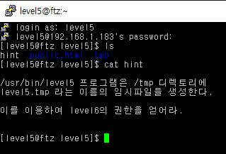
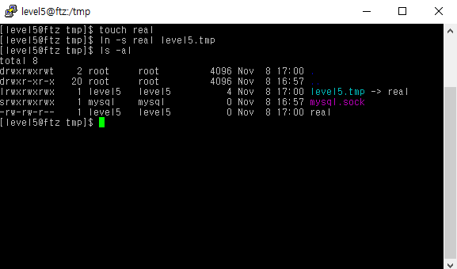
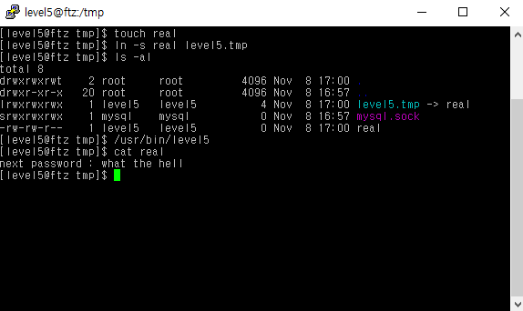

# level 5

* id : `level5`
* pw : `what is your name?`



원래는 race condition 으로 프로그램을 만드는 문제같은데..

이상하게 저기 `/tmp` 디렉토리에 `level5.tmp`파일만 만들면 된다.

하지만, race condition 으로 문제를 풀어보자.



```
cd /tmp
touch real
ln -s real level5.tmp
```
`real` 이란 파일을 만들고 그에 대한 소프트 링크 (바로가기)를 `level5.tmp`란 파일로 만든다.

이 상태로 프로그램이 실행되면, `level5.tmp` 라는 파일에 쓰기를 시도하면 실제론 `real`에 파일이 쓰여지지만, 삭제를 할 경우 바로가기인 `level5.tmp`파일만 삭제될 것이다.




GG