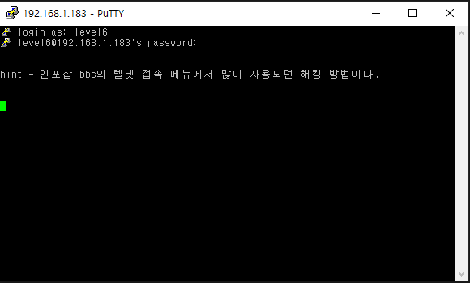
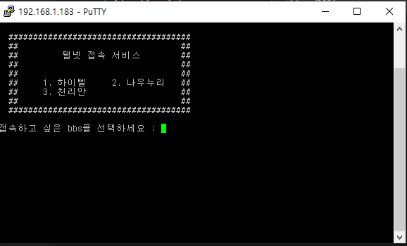
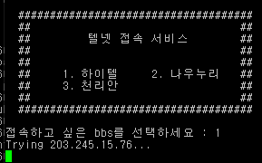
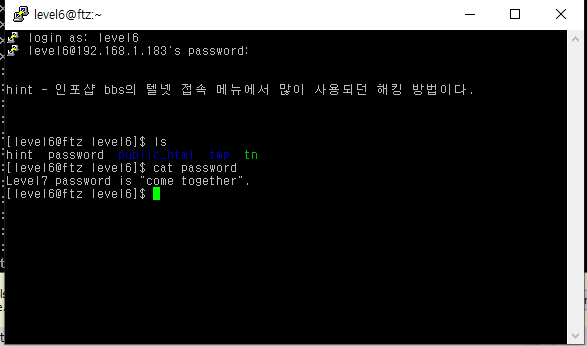
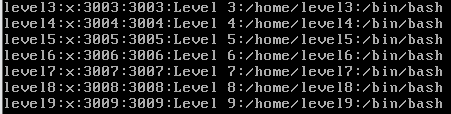
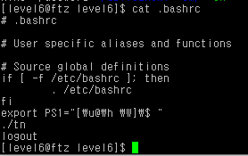

# level 6

* id : `level6`
* pw : `what the hell`

흠.. 평소같이 쉘이 안뜨고 이렇게 나온다. 엔터를 누르면 다음으로 넘어간다.

이런식으로 텔넷 접속 서비스가 나오지만, 1번 2번 3번 모두 임의의(?) 서버주소라서 커넥션 에러가 뜨거나 바로 커맨드가 닫힌다.

어이없게도, 그냥 힌트가 나올때 `Ctrl+C` 버튼을 눌러서 프로그램을 빠져나오면 해당 쉘 권한을 획득할수 있다.

동일 폴더에 password를 출력하면 끝.

root 로 들어가 잠시 확인해보니, level6으로 접속하면 /bin/bash가 실행되긴 하는데, 그걸로 바로 `tn`이라는 프로그램을 실행한다. 애초에 배시 위에서 실행이 되는거니 `Ctrl+C`로 빠져나올수 있었던 것이다.