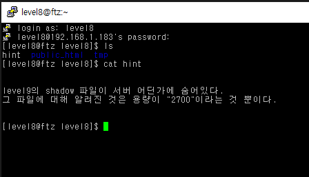
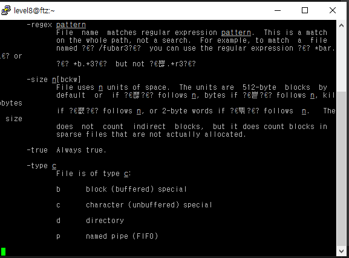
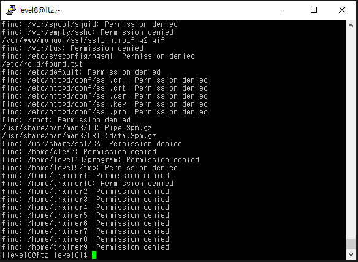
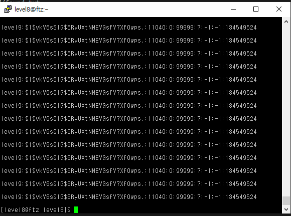
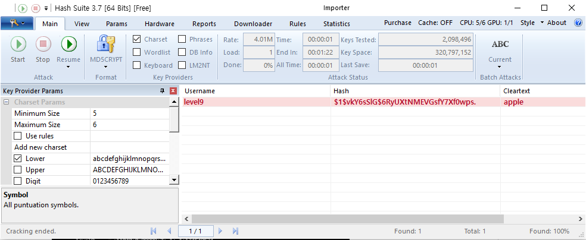

# level 8

* id : `level8`
* pw : `break the world`





> man find
메뉴얼 페이지를 봐보면 -size 옵션이 있다. 뒤에 c를 붙여야 바이트 단위로 검색해서 결론적으로 이런식으로 명령어를 입력하면 된다.

```
find / -size 2700c
```



> /etc/rc.d/found.txt
발견했다. cat해보자



역시나 Shadow파일이다. 복호화 하는건 힘들고, `Jack the Ripper`나 `Johnny` 같은걸 쓰면 쉽게 뚫을 수 있다. 잭더리퍼 개발자가 윈도우 버전으로 새로 만들고 있다는 [Hash suite](https://hashsuite.openwall.net/download)라는 프로그램으로 비밀번호를 얻었다.



GG!